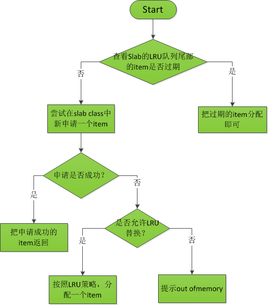

##memcache slab模块源码解读

###slab模块简介

由于采用常用的malloc和free函数会造成内存碎片比较多，所以memcache采用的是自己写的slab内存管理模块来管理内存，特点如下：

- 系统中用不同大小的chunk(`struct item`)来存数据，对某个需要缓存的数据，找到最适合大小的item来保存
- 系统中分为多个slabclass，每个slabclass有一个或多个slab，每个slab里面包含多个大小相同的item

###slab结构体关系图

我们从某个slabclass来看其与slab、item之间的关系


从图中可以看出，每个slabclass对应一个或多个slab，在slabclass_t结构体里面有个slab_list数组，其指向的是每个slab内存块的首地址(在这里，特别说明一下，slab是一段连续的内存空间，和操作系统中的内存页有点类似，memcache没有专门的一个结构体来描述它，只要其首地址来比较某个slab)，而每个slab中有多个chunk(`struct item`)数据块用来存数据


###整个系统的slab初始化过程

在memcache模块初始化的时候，首先调用的函数是`slab_init`，其源码如下：

```

/**
 * Determines the chunk sizes and initializes the slab class descriptors
 * accordingly.
 */
void slabs_init(const size_t limit, const double factor, const bool prealloc) {
    int i = POWER_SMALLEST - 1;
    unsigned int size = sizeof(item) + settings.chunk_size;

    mem_limit = limit;

    if (prealloc) {
        /* Allocate everything in a big chunk with malloc */
        mem_base = malloc(mem_limit);
        if (mem_base != NULL) {
            mem_current = mem_base;
            mem_avail = mem_limit;
        } else {
            fprintf(stderr, "Warning: Failed to allocate requested memory in"
                    " one large chunk.\nWill allocate in smaller chunks\n");
        }
    }

    memset(slabclass, 0, sizeof(slabclass));

    while (++i < POWER_LARGEST && size <= settings.item_size_max / factor) {
        /* Make sure items are always n-byte aligned */
        if (size % CHUNK_ALIGN_BYTES)
            size += CHUNK_ALIGN_BYTES - (size % CHUNK_ALIGN_BYTES);

        slabclass[i].size = size;
        slabclass[i].perslab = settings.item_size_max / slabclass[i].size;
        size *= factor;
        if (settings.verbose > 1) {
            fprintf(stderr, "slab class %3d: chunk size %9u perslab %7u\n",
                    i, slabclass[i].size, slabclass[i].perslab);
        }
    }

    power_largest = i;
    slabclass[power_largest].size = settings.item_size_max;
    slabclass[power_largest].perslab = 1;
    if (settings.verbose > 1) {
        fprintf(stderr, "slab class %3d: chunk size %9u perslab %7u\n",
                i, slabclass[i].size, slabclass[i].perslab);
    }

    /* for the test suite:  faking of how much we've already malloc'd */
    {
        char *t_initial_malloc = getenv("T_MEMD_INITIAL_MALLOC");
        if (t_initial_malloc) {
            mem_malloced = (size_t)atol(t_initial_malloc);
        }

    }

    if (prealloc) {
        slabs_preallocate(power_largest);
    }
}

```

我们来分析这个函数：

1. 首先申请mem_limit大小的内存块
2. while循环中对管理item大小不同的slabclass_t结构体进行初始化
3. 调用`slabs_preallocate`对分配mem_limit大小的内存块进行具体的处理


下面，我们来看`slabs_preallocate`的代码：

```

static void slabs_preallocate (const unsigned int maxslabs) {
    int i;
    unsigned int prealloc = 0;

    /* pre-allocate a 1MB slab in every size class so people don't get
       confused by non-intuitive "SERVER_ERROR out of memory"
       messages.  this is the most common question on the mailing
       list.  if you really don't want this, you can rebuild without
       these three lines.  */

    for (i = POWER_SMALLEST; i <= POWER_LARGEST; i++) {
        if (++prealloc > maxslabs)
            return;
        if (do_slabs_newslab(i) == 0) {
            fprintf(stderr, "Error while preallocating slab memory!\n"
                "If using -L or other prealloc options, max memory must be "
                "at least %d megabytes.\n", power_largest);
            exit(1);
        }
    }

}

```

从代码可以看出：

1. `slabs_preallocate`会对所有的slabclass_t进行分配slab的操作（这里需要注意的是，初始化的时候默认每个slabclass是只有一个slab的），即 `do_slabs_newslab`函数


下面就进接着看`do_slabs_newslab`函数

```
static int do_slabs_newslab(const unsigned int id) {
    slabclass_t *p = &slabclass[id];
    int len = 
		? settings.item_size_max
        : p->size * p->perslab;
    char *ptr;

    if ((mem_limit && mem_malloced + len > mem_limit && p->slabs > 0) ||
        (grow_slab_list(id) == 0) ||
        ((ptr = memory_allocate((size_t)len)) == 0)) {

        MEMCACHED_SLABS_SLABCLASS_ALLOCATE_FAILED(id);
        return 0;
    }

    memset(ptr, 0, (size_t)len);
    split_slab_page_into_freelist(ptr, id);

    p->slab_list[p->slabs++] = ptr;
    mem_malloced += len;
    MEMCACHED_SLABS_SLABCLASS_ALLOCATE(id);

    return 1;
}

```

`do_slabs_newslab`函数的功能就是为某个slabclass新分配一个slab大小的内存块

1. 当memcache分配一个新的slab时会造成所使用的内存超过对定的mem_limit大小时，则会提示内存不够分配
2. 当mem_limit大小的内存够分配的时候，则调用`grow_slab_list`来根据需要扩充`struct slabclass_t`中`void **slab_list`数组的大小，然后就是用`memory_allocate`函数分配一个slab内存块
3. 然后调用`split_slab_page_into_freelist`函数把slab内存块分成若干个item，然后把这些空闲的item都插入到`slabclass_t`中的`void *slots`指向的链表中
4. 把新分配的slab的首地址添加到'slabclass_t`数组中去
5. 跟新memcache已申请的内存大小mem_malloced

这样memcache的slab模块的初始化工作就完成了


###item相关操作

在整个memcache内存管理slab系统初始化完成后，就进入了memcahe的运行阶段，这时候，会涉及到的一些操作是(在文件items.c中)

- item的分配
- item的释放
- item获取
- item链接到队列(当一个item被set的时候，会链接到队列)
- item从队列中取消链接

下面我们会依次序来说上述的几个操作：

####item的分配

**item的分配对应于`do_item_alloc`**

先给出`do_item_alloc`的程序流程图



然后贴出代码


    item *do_item_alloc(char *key, const size_t nkey, const int flags,
                    const rel_time_t exptime, const int nbytes,
                    const uint32_t cur_hv) {
    uint8_t nsuffix;
    item *it = NULL;
    char suffix[40];
    size_t ntotal = item_make_header(nkey + 1, flags, nbytes, suffix, &nsuffix);
    if (settings.use_cas) {
        ntotal += sizeof(uint64_t);
    }

    unsigned int id = slabs_clsid(ntotal);
    if (id == 0)
        return 0;

    mutex_lock(&cache_lock);
    /* do a quick check if we have any expired items in the tail.. */
    int tries = 5;
    int tried_alloc = 0;
    item *search;
    void *hold_lock = NULL;
    rel_time_t oldest_live = settings.oldest_live;

    search = tails[id];
    /* We walk up *only* for locked items. Never searching for expired.
     * Waste of CPU for almost all deployments */
    for (; tries > 0 && search != NULL; tries--, search=search->prev) {
        uint32_t hv = hash(ITEM_key(search), search->nkey, 0);
        /* Attempt to hash item lock the "search" item. If locked, no
         * other callers can incr the refcount
         */
        /* FIXME: I think we need to mask the hv here for comparison? */
        if (hv != cur_hv && (hold_lock = item_trylock(hv)) == NULL)
            continue;
        /* Now see if the item is refcount locked */
        if (refcount_incr(&search->refcount) != 2) {
            refcount_decr(&search->refcount);
            /* Old rare bug could cause a refcount leak. We haven't seen
             * it in years, but we leave this code in to prevent failures
             * just in case */
            if (search->time + TAIL_REPAIR_TIME < current_time) {
                itemstats[id].tailrepairs++;
                search->refcount = 1;
                do_item_unlink_nolock(search, hv);
            }
            if (hold_lock)
                item_trylock_unlock(hold_lock);
            continue;
        }

        /* Expired or flushed */
		/**检查LRU尾部的item是否超时，如果超时直接，返回这个item即可**/
        if ((search->exptime != 0 && search->exptime < current_time)
            || (search->time <= oldest_live && oldest_live <= current_time)) {
            itemstats[id].reclaimed++;
            if ((search->it_flags & ITEM_FETCHED) == 0) {
                itemstats[id].expired_unfetched++;
            }
            it = search;
            slabs_adjust_mem_requested(it->slabs_clsid, ITEM_ntotal(it), ntotal);
            do_item_unlink_nolock(it, hv);
            /* Initialize the item block: */
            it->slabs_clsid = 0;
        } else if ((it = slabs_alloc(ntotal, id)) == NULL) { /*尝试去slab中申请一个新的item*/
            tried_alloc = 1;
            if (settings.evict_to_free == 0) {/*如果在slab中申请失败，并且不允许LRU替换策略*/
                itemstats[id].outofmemory++;
            } else {/*如果在slab申请失败，但是允许LRU策略，那么就从LRU队尾取出一个item*/
                itemstats[id].evicted++;
                itemstats[id].evicted_time = current_time - search->time;
                if (search->exptime != 0)
                    itemstats[id].evicted_nonzero++;
                if ((search->it_flags & ITEM_FETCHED) == 0) {
                    itemstats[id].evicted_unfetched++;
                }
                it = search;
                slabs_adjust_mem_requested(it->slabs_clsid, ITEM_ntotal(it), ntotal);
                do_item_unlink_nolock(it, hv);
                /* Initialize the item block: */
                it->slabs_clsid = 0;

                /* If we've just evicted an item, and the automover is set to
                 * angry bird mode, attempt to rip memory into this slab class.
                 * TODO: Move valid object detection into a function, and on a
                 * "successful" memory pull, look behind and see if the next alloc
                 * would be an eviction. Then kick off the slab mover before the
                 * eviction happens.
                 */
                if (settings.slab_automove == 2)
                    slabs_reassign(-1, id);
            }
        }

        refcount_decr(&search->refcount);
        /* If hash values were equal, we don't grab a second lock */
        if (hold_lock)
            item_trylock_unlock(hold_lock);
        break;
    }

    if (!tried_alloc && (tries == 0 || search == NULL))
        it = slabs_alloc(ntotal, id);

    if (it == NULL) {
        itemstats[id].outofmemory++;
        mutex_unlock(&cache_lock);
        return NULL;
    }

    assert(it->slabs_clsid == 0);
    assert(it != heads[id]);

    /* Item initialization can happen outside of the lock; the item's already
     * been removed from the slab LRU.
     */
    it->refcount = 1;     /* the caller will have a reference */
    mutex_unlock(&cache_lock);
    it->next = it->prev = it->h_next = 0;
    it->slabs_clsid = id;

    DEBUG_REFCNT(it, '*');
    it->it_flags = settings.use_cas ? ITEM_CAS : 0;
    it->nkey = nkey;
    it->nbytes = nbytes;
    memcpy(ITEM_key(it), key, nkey);
    it->exptime = exptime;
    memcpy(ITEM_suffix(it), suffix, (size_t)nsuffix);
    it->nsuffix = nsuffix;
    return it;
    }

**请注意：**我刚开始读这段代码的时候有个最不清楚的地方就是那个for循环好像执行了5次，如果这5次for循环都没找到过期的item，那么岂不是会调用`slab_alloc`函数5次，重复分配了5次item吗？

**答案**：后来仔细一看，原来在for循环的最后一行代码有个break语句，那么这就说明其实for循环里面的语句最多执行一次，也就不会有上面的问题了。

其他的请直接看代码的注释吧，有关于线程那块的代码，目前还不理解，等看完对应块之后，再回来修改

####item的释放

**item的释放对应于函数`item_free`**

先贴出代码：

    void item_free(item *it) {
        size_t ntotal = ITEM_ntotal(it);
        unsigned int clsid;
        assert((it->it_flags & ITEM_LINKED) == 0);
        assert(it != heads[it->slabs_clsid]);
        assert(it != tails[it->slabs_clsid]);
        assert(it->refcount == 0);

        /* so slab size changer can tell later if item is already free or not */
        clsid = it->slabs_clsid;
        it->slabs_clsid = 0;
        DEBUG_REFCNT(it, 'F');
        slabs_free(it, ntotal, clsid);
    }

这个函数比较简单，主要是调用`slab_free`函数来修改item的指针，把它添加到slabclass中的slots里面，但是这里我有个问题还没弄清楚的是，为什么要把it->slabs_clsid设置成0？

####item获取

**获取item的value的时候用的是`do_item_get`**

    item *do_item_get(const char *key, const size_t nkey, const uint32_t hv) {
    //mutex_lock(&cache_lock);
    item *it = assoc_find(key, nkey, hv);  //通过key查找item指针
    if (it != NULL) {
        refcount_incr(&it->refcount);
        /* Optimization for slab reassignment. prevents popular items from
         * jamming in busy wait. Can only do this here to satisfy lock order
         * of item_lock, cache_lock, slabs_lock. */
        if (slab_rebalance_signal &&
            ((void *)it >= slab_rebal.slab_start && (void *)it < slab_rebal.slab_end)) {
            do_item_unlink_nolock(it, hv);
            do_item_remove(it);
            it = NULL;
        }
    }
    //mutex_unlock(&cache_lock);
    int was_found = 0;

    if (settings.verbose > 2) {
        if (it == NULL) {//没有对应的key
            fprintf(stderr, "> NOT FOUND %s", key);
        } else {
            fprintf(stderr, "> FOUND KEY %s", ITEM_key(it));
            was_found++;
        }
    }

    if (it != NULL) {
        if (settings.oldest_live != 0 && settings.oldest_live <= current_time &&
            it->time <= settings.oldest_live) {//有没有flush
            do_item_unlink(it, hv);
            do_item_remove(it);
            it = NULL;
            if (was_found) {
                fprintf(stderr, " -nuked by flush");
            }
        } else if (it->exptime != 0 && it->exptime <= current_time) {//过期了的item
            do_item_unlink(it, hv);
            do_item_remove(it);
            it = NULL;
            if (was_found) {
                fprintf(stderr, " -nuked by expire");
            }
        } else {
            it->it_flags |= ITEM_FETCHED; //成功取到了value
            DEBUG_REFCNT(it, '+');
        }
    }

    if (settings.verbose > 2)
        fprintf(stderr, "\n");

    return it;
    }


####item链接到队列

    int do_item_link(item *it, const uint32_t hv) {
        MEMCACHED_ITEM_LINK(ITEM_key(it), it->nkey, it->nbytes);
        assert((it->it_flags & (ITEM_LINKED|ITEM_SLABBED)) == 0);
        mutex_lock(&cache_lock);
        it->it_flags |= ITEM_LINKED;
        it->time = current_time;

        STATS_LOCK();
        stats.curr_bytes += ITEM_ntotal(it);
        stats.curr_items += 1;
        stats.total_items += 1;
        STATS_UNLOCK();

        /* Allocate a new CAS ID on link. */
        ITEM_set_cas(it, (settings.use_cas) ? get_cas_id() : 0);
        assoc_insert(it, hv);  //连接到hash队列
        item_link_q(it); //链接到LRU队列
        refcount_incr(&it->refcount);
        mutex_unlock(&cache_lock);

        return 1;
    }

####item取消链接

    void do_item_unlink(item *it, const uint32_t hv) {
        MEMCACHED_ITEM_UNLINK(ITEM_key(it), it->nkey, it->nbytes);
        mutex_lock(&cache_lock);
        if ((it->it_flags & ITEM_LINKED) != 0) {
            it->it_flags &= ~ITEM_LINKED;
            STATS_LOCK();
            stats.curr_bytes -= ITEM_ntotal(it);
            stats.curr_items -= 1;
            STATS_UNLOCK();
            assoc_delete(ITEM_key(it), it->nkey, hv); //从hash队列中移除
            item_unlink_q(it); //从LRU队列移除
            do_item_remove(it); //移除item
        }
        mutex_unlock(&cache_lock);
    }

