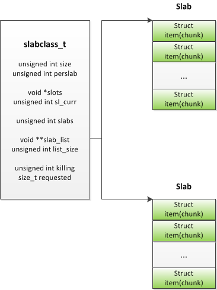

##memcache slab模块源码解读

###slab模块简介

由于采用常用的malloc和free函数会造成内存碎片比较多，所以memcache采用的是自己写的slab内存管理模块来管理内存，特点如下：

- 系统中用不同大小的chunk(`struct item`)来存数据，对某个需要缓存的数据，找到最适合大小的item来保存
- 系统中分为多个slabclass，每个slabclass有一个或多个slab，每个slab里面包含多个大小相同的item

###slab结构体关系图

我们从某个slabclass来看其与slab、item之间的关系



从图中可以看出，每个slabclass对应一个或多个slab，在slabclass_t结构体里面有个slab_list数组，其指向的是每个slab内存块的首地址(在这里，特别说明一下，slab是一段连续的内存空间，和操作系统中的内存页有点类似，memcache没有专门的一个结构体来描述它，只要其首地址来比较某个slab)，而每个slab中有多个chunk(`struct item`)数据块用来存数据


###整个系统的slab初始化过程

在memcache模块初始化的时候，首先调用的函数是`slab_init`，其源码如下：

```

/**
 * Determines the chunk sizes and initializes the slab class descriptors
 * accordingly.
 */
void slabs_init(const size_t limit, const double factor, const bool prealloc) {
    int i = POWER_SMALLEST - 1;
    unsigned int size = sizeof(item) + settings.chunk_size;

    mem_limit = limit;

    if (prealloc) {
        /* Allocate everything in a big chunk with malloc */
        mem_base = malloc(mem_limit);
        if (mem_base != NULL) {
            mem_current = mem_base;
            mem_avail = mem_limit;
        } else {
            fprintf(stderr, "Warning: Failed to allocate requested memory in"
                    " one large chunk.\nWill allocate in smaller chunks\n");
        }
    }

    memset(slabclass, 0, sizeof(slabclass));

    while (++i < POWER_LARGEST && size <= settings.item_size_max / factor) {
        /* Make sure items are always n-byte aligned */
        if (size % CHUNK_ALIGN_BYTES)
            size += CHUNK_ALIGN_BYTES - (size % CHUNK_ALIGN_BYTES);

        slabclass[i].size = size;
        slabclass[i].perslab = settings.item_size_max / slabclass[i].size;
        size *= factor;
        if (settings.verbose > 1) {
            fprintf(stderr, "slab class %3d: chunk size %9u perslab %7u\n",
                    i, slabclass[i].size, slabclass[i].perslab);
        }
    }

    power_largest = i;
    slabclass[power_largest].size = settings.item_size_max;
    slabclass[power_largest].perslab = 1;
    if (settings.verbose > 1) {
        fprintf(stderr, "slab class %3d: chunk size %9u perslab %7u\n",
                i, slabclass[i].size, slabclass[i].perslab);
    }

    /* for the test suite:  faking of how much we've already malloc'd */
    {
        char *t_initial_malloc = getenv("T_MEMD_INITIAL_MALLOC");
        if (t_initial_malloc) {
            mem_malloced = (size_t)atol(t_initial_malloc);
        }

    }

    if (prealloc) {
        slabs_preallocate(power_largest);
    }
}

```

我们来分析这个函数：

1. 首先申请mem_limit大小的内存块
2. while循环中对管理item大小不同的slabclass_t结构体进行初始化
3. 调用`slabs_preallocate`对分配mem_limit大小的内存块进行具体的处理


下面，我们来看`slabs_preallocate`的代码：

```

static void slabs_preallocate (const unsigned int maxslabs) {
    int i;
    unsigned int prealloc = 0;

    /* pre-allocate a 1MB slab in every size class so people don't get
       confused by non-intuitive "SERVER_ERROR out of memory"
       messages.  this is the most common question on the mailing
       list.  if you really don't want this, you can rebuild without
       these three lines.  */

    for (i = POWER_SMALLEST; i <= POWER_LARGEST; i++) {
        if (++prealloc > maxslabs)
            return;
        if (do_slabs_newslab(i) == 0) {
            fprintf(stderr, "Error while preallocating slab memory!\n"
                "If using -L or other prealloc options, max memory must be "
                "at least %d megabytes.\n", power_largest);
            exit(1);
        }
    }

}

```

从代码可以看出：

1. `slabs_preallocate`会对所有的slabclass_t进行分配slab的操作（这里需要注意的是，初始化的时候默认每个slabclass是只有一个slab的），即 `do_slabs_newslab`函数


下面就进接着看`do_slabs_newslab`函数

```
static int do_slabs_newslab(const unsigned int id) {
    slabclass_t *p = &slabclass[id];
    int len = 
		? settings.item_size_max
        : p->size * p->perslab;
    char *ptr;

    if ((mem_limit && mem_malloced + len > mem_limit && p->slabs > 0) ||
        (grow_slab_list(id) == 0) ||
        ((ptr = memory_allocate((size_t)len)) == 0)) {

        MEMCACHED_SLABS_SLABCLASS_ALLOCATE_FAILED(id);
        return 0;
    }

    memset(ptr, 0, (size_t)len);
    split_slab_page_into_freelist(ptr, id);

    p->slab_list[p->slabs++] = ptr;
    mem_malloced += len;
    MEMCACHED_SLABS_SLABCLASS_ALLOCATE(id);

    return 1;
}

```

`do_slabs_newslab`函数的功能就是为某个slabclass新分配一个slab大小的内存块

1. 当memcache分配一个新的slab时会造成所使用的内存超过对定的mem_limit大小时，则会提示内存不够分配
2. 当mem_limit大小的内存够分配的时候，则调用`grow_slab_list`来根据需要扩充`struct slabclass_t`中`void **slab_list`数组的大小，然后就是用`memory_allocate`函数分配一个slab内存块
3. 然后调用`split_slab_page_into_freelist`函数把slab内存块分成若干个item，然后把这些空闲的item都插入到`slabclass_t`中的`void *slots`指向的链表中
4. 把新分配的slab的首地址添加到'slabclass_t`数组中去
5. 跟新memcache已申请的内存大小mem_malloced

这样memcache的slab模块的初始化工作就完成了
